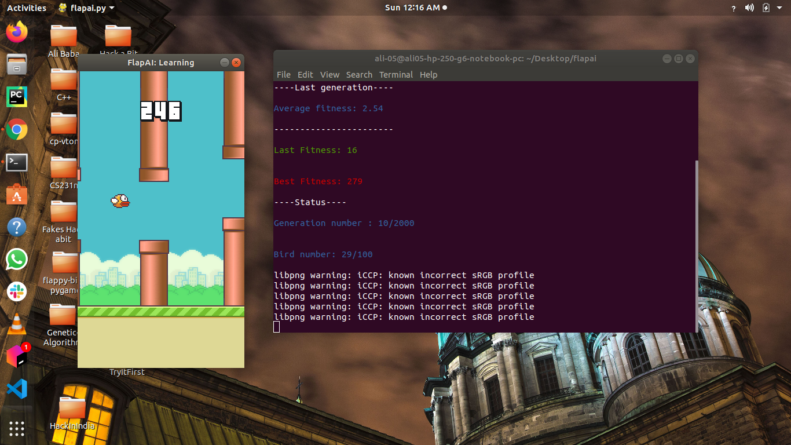
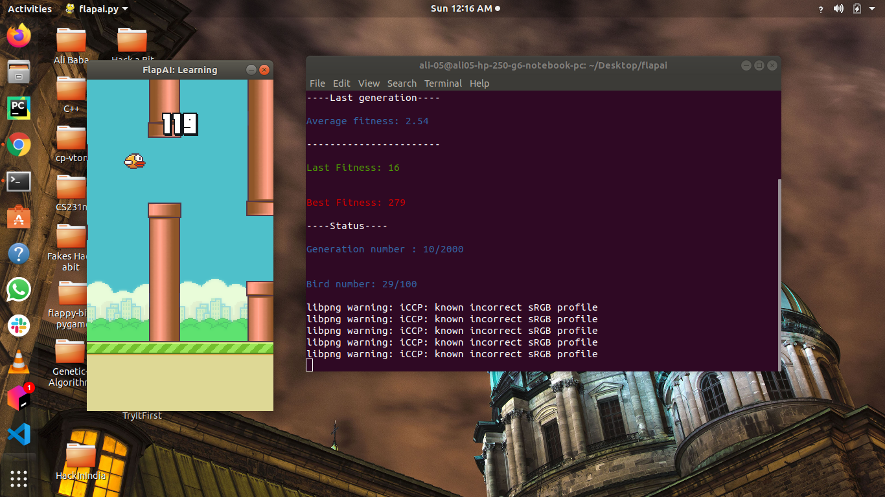
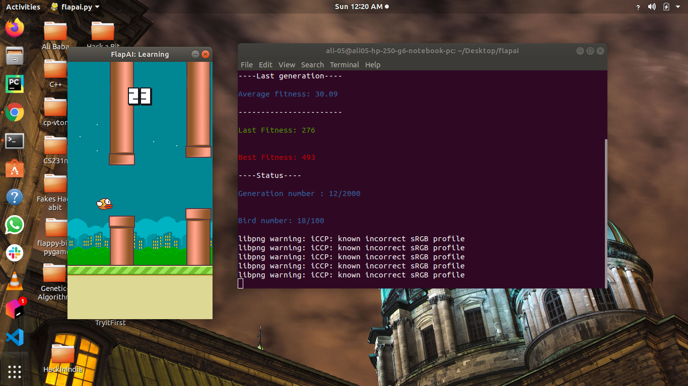

# Flappy Bird Game : trained using Genetic algorithm
### Introduction
---
**FlapAI** is a genetic algorithm coded in Python teaching itself how to play Flappy Bird. It can reach score of 1000+ pipes in less than 100 generations with population of just 100. It is based on [FlapPyBird](https://github.com/sourabhv/FlapPyBird). All settings can be found in **config.py**  and can be adjusted accordingly. Neural networks are saved in a json file for further evaluation. Each time you run FlapAI, statistics and the neural network of the best performing bird are saved in the directory **save/**
### Features
---
- Customizable genetic algorithm
- Speed up *(FPS can be set)*
- Statistics
- Running a single Neural Network from a json file
- Cool ASCII art
- Neural Network - It is 4 layer NN with customizable number of neurons in each hidden layer.It is trained using genetic algorithm with population of 100.

### Requirements
---
- pygame
- numpy
- matplotlib
- colorama *(cool colored **print**)*


### Usage
---
If you want to train birds with the parameters in config.py just run FlapAI.
```sh
python flapai.py
```
To evaluate a single Neural Network use **-evaluate** (some can be found in **/interestingannsave**)
```sh
python flapai.py -evaluate neuralnetwork.json
```
If you want to see the statistics of a past experiment use **-stats**
```sh
python flapai.py -stats save/2016-08-27_17:16:04
```
### Keyboard commands
---
Press **UP ARROW** while focusing the game window to speed up the game **(if the screen is frozen it means that pygame doesn't redraw the window anymore which speeds up the algorithm a lot)**
#
Press **DOWN ARROW** while focusing the game window to slow down the game
#
Press **ESC** while focusing the game window to stop the algorithm and show the statistics **(don't use CTRL+C in the terminal)**

### Screenshots
---




